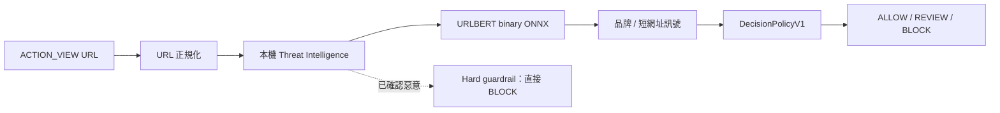

# URL Guardian

URL Guardian 是一個在 Android 裝置上執行的釣魚網址分析工具。當其他 App 嘗試用 HTTP 或 HTTPS 開啟連結時，可以把網址交給 URL Guardian，在網址進入瀏覽器之前先完成本機分析，並顯示 ALLOW、REVIEW 或 BLOCK 與判斷原因。

App 沒有宣告 `INTERNET` 與 `ACCESS_NETWORK_STATE` 權限。模型推論、情資比對與字串特徵計算都在裝置上完成，分析不會對外連線，也不會開啟待分析網址或讀取頁面內容。

- 專案版本 1.0.0（Android `versionCode 11`、`versionName 1.0.0`）
- `minSdk 26`、`targetSdk 35`、`compileSdk 35`
- 已在一台 Xiaomi 23013PC75G（Android 15 / API 35、arm64-v8a）完成實機驗證

## 系統架構



實際順序是：URL 正規化 → Threat Intelligence 查詢 → lexical features → URLBERT binary 推論 → 品牌與短網址訊號 → DecisionPolicyV1 → hard guardrail。

已知惡意由 deterministic 規則處理：情資確認為 malicious 時直接 BLOCK，模型輸出或 whitelist 不能覆寫。情資回傳 UNKNOWN 只代表快照沒有收錄，程式不會把它當成 SAFE。

流程中沒有 cloud inference、沒有 HTTPS MITM，也不會用 WebView 開啟待分析網址。

## 模型

主要模型是 `URLBERT_PHISHING_BINARY_V1`：以 `CrabInHoney/urlbert-tiny-v6`（Apache-2.0，2.03M 參數的 ModernBERT encoder）為 base，接上二分類 head 微調，輸入固定為 registrable domain、最大長度 32，export 成 ONNX 後由 ONNX Runtime Android 1.30.0 CPU 執行。

Dataset 為 `dataset-v1.3.0`（BENIGN 20,000 / PHISHING 20,000），使用同一個 frozen test set 比較 LightGBM 與 URLBERT：

| 指標 | LightGBM binary | URLBERT binary |
| --- | ---: | ---: |
| Precision | 0.6603 | 0.7654 |
| Recall | 0.6443 | 0.7168 |
| F1 | 0.6522 | 0.7403 |
| Specificity | 0.6668 | 0.7791 |
| Benign FPR | 0.3332 | 0.2209 |
| AUROC | 0.7092 | 0.8300 |
| AUPRC | 0.7242 | 0.8409 |

Frozen Test Set SHA-256 為 `379c753e8744e9906c68b0bac69ab69525abc27c1bf6de2ff8eecdef5a97fdea`，Test Manifest 為 `bf640e52884a4b86d5edd6af25f686df3bc6534a181756161caf9c2721f84460`。

Android 上以 65 筆 frozen fixtures 做跨語言 parity：normalizer 65/65、DecisionPolicyV1 65/65、ONNX 類別一致率 100%，最大機率誤差 `3.7128e-07`。

## 資料與研究修正

早期版本使用 BENIGN / PHISHING / MALWARE 三類標籤（`dataset-v1.1.0`）。檢查錯誤分佈後發現，MALWARE 的高 recall 幾乎來自 IP host：Test set 中 659 筆 IP-host MALWARE 全部答對，65 筆非 IP MALWARE 全部答錯；移除三個 IP 特徵後結果沒有改善。

Phase 2.5 以 `dataset-v1.2.0` 加入 2,642 筆 ThreatFox domain-hosted malware 重新量化這個問題：URLBERT V2 的 Non-IP MALWARE Recall 只有 0.0325，ThreatFox source-holdout recall 只有 0.0027。結論是 `DOMAIN_ONLY` 表示法無法泛化到 domain-hosted malware。

因此 Phase 2.6 起，主要 ML 任務改為 binary phishing，MALWARE 改由 Threat Intelligence 以證據處理。`dataset-v1.3.0` 的 PHISHING 來自 CERT Polska（10,000）、Phishing.Database（9,894）與 OpenPhish（106），單一來源上限 50%，BENIGN 來自 Tranco；沒有 synthetic 或 duplicate rows。

Split 使用 registrable domain group split（seed 42、70/15/15），同一個 registrable domain 不會同時出現在 Train、Validation、Test。Train 28,000 / Validation 6,000 / Test 6,000，Test 只評估一次。

原始與處理後資料集包含大量 active phishing URL，且各來源有各自的授權條款，因此這個 repository 不散布資料檔，只保留 metadata 與雜湊值；重建方式見 `data/README.md`。

## Android 實作

- Kotlin 2.2.21、Jetpack Compose（BOM 2024.09.03）、ONNX Runtime Android 1.30.0
- 攔截 http / https 的 `ACTION_VIEW`；ALLOW 與 REVIEW 可明確交接給外部瀏覽器，BLOCK 預設不提供繼續按鈕
- Handoff 有 `IntentLoopGuard`，避免 URL Guardian 與其他 App 互相重複開啟
- 本機 Threat Intelligence Bundle：7,833 個 indicator digests、54 個品牌、26 個短網址網域；匯入前驗證 integrity digest，失敗保留目前 bundle，也可以回復上一版
- `ReasonCodeV1`：ALLOW / REVIEW / BLOCK 都附穩定的原因代碼，畫面同時顯示品牌比對、短網址與 bundle 來源
- 未支援 scheme（`javascript:`、`file:`、`content:`、`intent:`、`data:`、`ftp:`、`ws:`）在解析前就被拒絕，不會進入 handoff
- Release build 開啟 R8 minify 與 resource shrinking；只保留 ONNX Runtime、org.json 等必要項目

## 測試結果

| 項目 | 結果 |
| --- | --- |
| Python tests | 325 passed |
| Android JVM tests | 40 debug + 40 release passed |
| Golden parity（normalizer / features / PolicyV1） | 65 / 65 |
| PyTorch–ONNX class agreement | 100% |
| Adversarial URL corpus | 46 / 46 |
| Adversarial brand / shortener cases | 12 / 12、8 / 8 |
| Unsupported schemes | 7 / 7 rejected，無 handoff |
| TI bundle import / corrupted rejection / rollback | PASS |
| Browser handoff / loop prevention | PASS |
| Rotation / Activity recreation | PASS |
| 實機 benchmark（Phase 7 RC，20 warmup / 100 量測） | 平均 3.691 ms、P50 3.402 ms、P95 5.156 ms |
| 實機 benchmark（1.0.0 production build） | 平均 3.943 ms、P50 3.672 ms、P95 5.314 ms |
| URLBERT 推論（1.0.0） | 平均 3.193 ms、P50 2.955 ms、P95 4.340 ms |
| 500 次連續本機分析 | 無 crash、無 ANR、無 browser handoff |

實機 benchmark 數據是同一台裝置上兩種 build 的分開量測，方法與限制見 `docs/android_validation.md`。

公開版本保留全部測試程式碼。由於資料集與模型權重沒有散布，部分測試會以明確理由 skip：在這個 repository 直接執行 `pytest` 的結果是 **280 passed / 45 skipped / 0 failed**，skip 訊息會指出缺少哪個資料或模型檔。完整開發環境（含資料與模型）的結果是 325 passed。Android 端則在這個 repository 的獨立複本上實際執行 `testDebugUnitTest`、`testReleaseUnitTest` 與 `assembleDebug`（JDK 17、Android SDK 35），JVM tests 40 + 40 通過。

## 未校準機率

模型輸出的 0–1 分數是 URLBERT 的 phishing score（uncalibrated probability），不是真實世界的發生機率。分數 0.80 不能直接解釋成「這個網址有 80% 機率是釣魚網站」；畫面因此以「AI 風險分數」呈現，技術說明標註 uncalibrated。

專案做過 temperature scaling 校準實驗。URLBERT binary 的 Test ECE 由 0.0235 變為 0.0269，校準後沒有改善，因此正式版本保留 uncalibrated 輸出，結果如實記錄於 `docs/evaluation.md`。

## 安全設計

- App 未宣告 `INTERNET`、`ACCESS_NETWORK_STATE` 或任何 dangerous permission
- 不對待分析網址做 HTTP / DNS / socket 連線，不使用 WebView 載入該網址
- 情資確認為 malicious 時一律 BLOCK，模型與 whitelist 不能覆寫
- Threat Intelligence 的 `UNKNOWN` 不等於 `SAFE`；`ERROR` 與 `UNAVAILABLE` 另外處理
- TI bundle 匯入前驗證 integrity digest，損毀的 bundle 會被拒絕並保留目前版本
- Shortener 訊號只會產生 REVIEW，不會單獨 BLOCK
- Release APK 經過權限、secret pattern 與已知網路函式庫掃描；repository 不包含 keystore、密碼或 signed artifact

## 限制

- 模型只看 URL 字串（registrable domain），看不到 HTML、JavaScript 或頁面內容
- Threat Intelligence 是凍結快照，會隨時間老化；離線優先代表即時情資更新能力有限
- 品牌與短網址 catalog 是人工維護的清單，有 false positive 與 false negative；短網址本身不代表惡意
- 模型分數未經 probability calibration
- Live redirect resolution 尚未部署，目前不會展開短網址
- 無法保證偵測所有釣魚網址
- 實機驗證目前涵蓋一台 ARM64 裝置，沒有多裝置矩陣
- 使用者需要在系統中自行選擇 URL Guardian 開啟連結；App 未要求 `ROLE_BROWSER`

## 專案歷程

| 階段 | 內容 |
| --- | --- |
| Phase 1 / 1.5 | 資料來源、normalization、domain-aware split、LightGBM baseline |
| Phase 2 / 2.5 | URLBERT、dataset artifact 分析、校準實驗 |
| Phase 2.6 | 改為 binary phishing；MALWARE 交由 Threat Intelligence |
| Phase 3 | UGDM 實驗（未優於 DecisionPolicyV1） |
| Phase 4 | ONNX export 與 Android 離線原型 |
| Phase 5 | 品牌 / 短網址 / TI bundle 與 DecisionPolicyV2（實驗） |
| Phase 6 | Release hardening、R8、adversarial corpus |
| Phase 7 | ARM64 實機資格驗證 |
| 1.0.0 | Production signing 與 final release 驗證 |

## Repository 結構

```text
android/            Kotlin / Compose app 與 JVM tests
configs/            Phase experiment 設定
data/               dataset metadata（不含資料檔）
deployment/         Android 執行資產、golden set、TI bundle、manifest
docs/               架構、研究、評估、驗證、授權與安全文件
licenses/           第三方授權原文（MPL-2.0）
models/             模型 metadata（不含大型權重）
scripts/            dataset 建置、audit 與 corpus 工具
src/                Python 套件：data、features、models、evaluation、deployment
tests/              Python 測試
LICENSE             Apache License 2.0（URL Guardian 自有程式碼）
THIRD_PARTY_NOTICES.md
SECURITY.md
CITATION.cff
```

## Build 與測試

Python：

```powershell
py -3.11 -m venv .venv
.\.venv\Scripts\python.exe -m pip install -e ".[dev]"
.\.venv\Scripts\python.exe -m pytest -q
```

Android（需要 JDK 17 與 Android SDK 35）：

```powershell
.\android\gradlew.bat -p android testDebugUnitTest testReleaseUnitTest
.\android\gradlew.bat -p android assembleDebug
```

Debug build 使用 debug key。Production signing 只從環境變數讀取，且 keystore 必須位於 repository 之外，設定方式見 `docs/development.md`。Production-signed binary 不在這個 repository 散布。

## References

- URLBERT base encoder: [CrabInHoney/urlbert-tiny-v6](https://huggingface.co/CrabInHoney/urlbert-tiny-v6)（Apache-2.0）
- Phishing.Database: [Phishing-Database/Phishing.Database](https://github.com/Phishing-Database/Phishing.Database)（MIT）
- Public Suffix List: [publicsuffix.org](https://publicsuffix.org/) / [publicsuffix/list](https://github.com/publicsuffix/list)（MPL-2.0）
- ONNX Runtime: [microsoft/onnxruntime](https://github.com/microsoft/onnxruntime)（MIT）

## License

URL Guardian 自有原始碼採用 Apache License 2.0（`LICENSE`）。除非另有註明，此授權只涵蓋原創程式碼與本專案產生的資產。

- 第三方軟體、模型、資料集與資料資源維持各自的授權，詳見 `THIRD_PARTY_NOTICES.md` 與 `docs/licensing_review.md`。
- 資料集授權由原始提供者決定；本 repository 不散布 raw malicious URL 資料集，Apache-2.0 不涵蓋任何第三方資料集。
- Public Suffix List 衍生的 `deployment/android/v1/public_suffixes.txt` 與 `deployment/android/v2/public_suffixes.txt` 維持 MPL-2.0，授權原文見 `licenses/MPL-2.0.txt`。
- 散布的 URLBERT ONNX 是 Apache-2.0 base encoder 的衍生；PyTorch checkpoint 不在本 repository 內。

## Security

安全回報方式見 `SECURITY.md`。請不要在公開 issue 張貼真實惡意網址、憑證或個資。

## Citation

本 repository 提供 `CITATION.cff`，GitHub 會依此顯示 citation 資訊。
