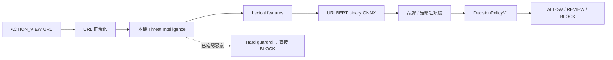

# 系統架構

## 執行流程

1. **URL 正規化**：處理 scheme、host 大小寫、trailing dot、port、IPv4 / IPv6、IDN / Punycode、percent encoding、path、query 與 fragment。未支援 scheme 在解析前就被拒絕。
2. **本機 Threat Intelligence**：以 TI Bundle v1（indicator digests）查詢，回傳 `KNOWN_MALICIOUS` / `UNKNOWN` / `UNAVAILABLE` / `ERROR`。
3. **Lexical features**：31 個純字串特徵（長度、符號、子網域、entropy 等），另加 31 維 availability mask 形成 62 維模型輸入。
4. **URLBERT binary ONNX**：registrable domain、max length 32，輸出 BENIGN / PHISHING 機率。
5. **品牌 / 短網址訊號**：`BrandCatalogV1`（54 個品牌）與 `ShortenerCatalogV1`（26 個網域）；短網址只產生 REVIEW，不會單獨 BLOCK。
6. **DecisionPolicyV1**：review 0.35 / block 0.85，輸出 `ReasonCodeV1`。
7. **Hard guardrail**：情資確認為 malicious 時直接 BLOCK，覆寫模型輸出。

## 決策與輸出契約

| 契約 | 內容 |
| --- | --- |
| Risk | `SAFE` / `SUSPICIOUS` / `DANGEROUS` |
| Action | `ALLOW` / `REVIEW` / `BLOCK` |
| Threat | `BENIGN` / `PHISHING` / `KNOWN_MALWARE` / `OTHER` |
| Feature schema | v1，31 features，availability mask 31，model input 62 |
| Policy | `DecisionPolicyV1`（預設、凍結）；`DecisionPolicyV2` 為 experimental |
| Probability | uncalibrated（binary 校準未改善 ECE） |

`DecisionPolicyV2` 加入品牌、官方網域、短網址與 cross-domain redirect 規則，只在 developer / research mode 可選，正式使用者預設仍是 V1。

## Android 模組

| 檔案 | 角色 |
| --- | --- |
| `MainActivity.kt` | Compose UI、手動輸入、`ACTION_VIEW` 入口、結果顯示與 handoff |
| `core/SecurityAnalyzer.kt` | 串接完整分析流程並回傳 `EngineDecision` |
| `core/UrlNormalizer.kt` | 與 Python 對齊的正規化實作 |
| `core/FeatureExtractor.kt` | 31 個特徵 |
| `core/ByteLevelBpeTokenizer.kt` | tokenizer parity |
| `core/UrlBertOnnx.kt` | ONNX Runtime session 與推論 |
| `core/DecisionPolicy.kt` / `DecisionPolicyV2.kt` | 政策實作 |
| `core/ThreatIntel.kt` | 情資查詢與狀態 |
| `core/TiBundle.kt` / `TiBundleStore.kt` | bundle 解析、integrity 驗證、atomic swap 與 rollback |
| `core/BrandDetectionEngine.kt` / `ShortenerDetectionEngine.kt` | 品牌與短網址訊號 |
| `core/IntentLoopGuard.kt` | 避免 handoff 迴圈 |
| `core/SchemeGuard.kt` | 未支援 scheme 拒絕 |

## 部署資產

- `deployment/android/v2/`：Android build 直接使用的 runtime 資產（ONNX、tokenizer、public suffixes、TI bundle、golden set）。
- `deployment/android/v1/`：Phase 4 凍結版本，v2 以此逐位元複製並通過 hash 驗證。
- `deployment/security/adversarial_urls_v1.json`：跨語言 parser parity corpus。
- `deployment/ti/snapshot_history.json`：Threat Intelligence snapshot 記錄。

## 離線保證

- App 沒有 `INTERNET` 與 `ACCESS_NETWORK_STATE` 權限。
- 不執行 HTTP / DNS / socket，不使用 WebView 載入待分析 URL。
- Redirect resolver 為 `NoOpRedirectResolver`：不展開、不連線。
- ONNX Runtime 的 telemetry initializer 已在 manifest 中移除。
